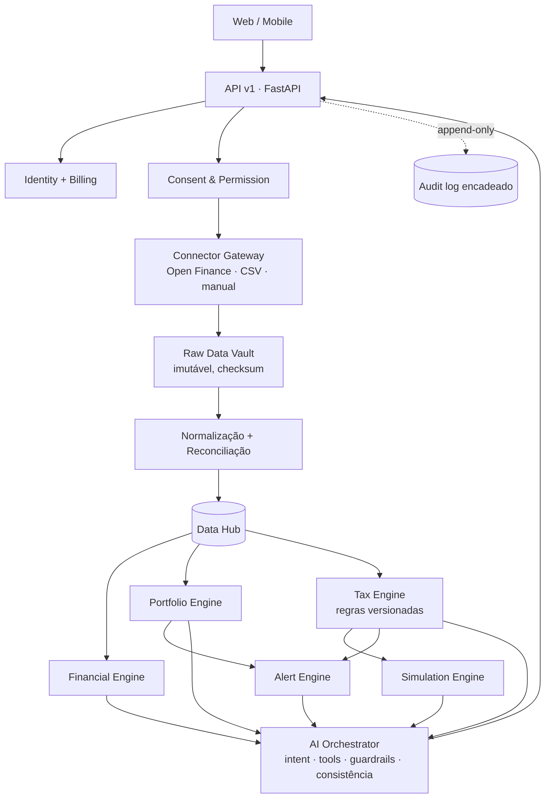

# Fintechs · Ramon Inteligência Financeira

> **Seu dinheiro gera dados. Nossa inteligência mostra o que eles significam.**

Plataforma de inteligência financeira e tributária para pessoa física: **consolida, analisa, simula, alerta e explica**.
A IA interpreta; os motores determinísticos calculam. Não é corretora nem consultoria de investimentos.


## O que está neste repositório

| Parte | Caminho | Estado |
|---|---|---|
| Landing page fiel à arte aprovada (1024 px escalado, responsiva abaixo de 760 px) | `apps/web/index.html` | pronto |
| App web: Início, Patrimônio, Finanças, Tributação, Simulador, Alertas, Documentos, Conexões, Assistente IA, Planos, Privacidade, Configurações · temas Claro/Escuro/Sistema | `apps/web/app/` | pronto (modo demo ou API) |
| API v1 FastAPI (31 rotas, Problem Details, Correlation-ID, Idempotency-Key) | `apps/api/` | pronto |
| Motores: Financial, Portfolio, Tax (regras versionadas), Simulation, Alert, Document, AI Orchestrator, Notification | `services/` | pronto |
| Consentimento, Data Hub (Raw Vault → normalização → reconciliação), auditoria encadeada | `services/consent`, `services/ingestion`, `services/audit` | pronto |
| Conectores: contrato único, importação CSV, Open Finance em **sandbox** | `connectors/` | produção depende de D-01 |
| Schema PostgreSQL com RLS por titular + rollback | `database/migrations/` | alvo de produção (ADR-0002) |
| Testes: golden cases tributários, guardrails de IA, segurança de upload, isolamento, E2E | `tests/` (63 testes) | passando |
| CI (lint, testes, contrato OpenAPI) e deploy do site no GitHub Pages | `.github/workflows/` | pronto |
| Análise dos documentos, decisões pendentes, ADRs, modelos CSV | `docs/` | pronto |

## Arquitetura



Linhagem de todo dado: `SOURCE → RAW → VALIDATED → NORMALIZED → RECONCILED → ENGINE RESULT → AI EXPLANATION` (origem, instituição, raw_id, competência, última verificação, versão do parser, status de reconciliação, qualidade).

## Rodando

### Só o site (modo demonstração, sem backend)

```bash
cd apps/web && python -m http.server 8080
# landing:  http://localhost:8080
# app:      http://localhost:8080/app/   (demo@ramon.app / demo2026ramon)
```

No modo demonstração os números vêm de `apps/web/app/data/demo.json`, **gerado pelos motores Python** (`python -m tools.export_demo`). O JavaScript não recalcula impostos.

### API + site

```bash
pip install -r requirements-dev.txt
RAMON_REFERENCE_DATE=2026-09-27 uvicorn apps.api.main:app --reload     # http://localhost:8000/docs
# em outro terminal, aponte o front para a API:
echo 'window.RAMON_API_BASE="http://localhost:8000";' > apps/web/app/js/config.js
cd apps/web && python -m http.server 8080
```

Ou com Docker: `docker compose -f infrastructure/docker/docker-compose.yml up --build` (site em :8080, API em :8000; `--profile db` sobe PostgreSQL e Redis).

### Testes e qualidade

```bash
RAMON_REFERENCE_DATE=2026-09-27 pytest      # 63 testes
ruff check .
```

## Regras que o código garante

* **IA sem autoridade de cálculo** — respostas usam apenas resultados de tools; número sem evidência é bloqueado (`consistency_check`).
* **Sem recomendação individualizada** — "devo comprar/vender…", "qual ação…", "monte uma carteira" acionam guardrail (CVM Res. 19).
* **Toda regra tributária tem código, versão, vigência, fonte, fórmula, exceções e testes**; regra `pending` nunca entra em cálculo.
* **Reprodutibilidade** — mesmo snapshot + mesma versão de regra = mesmo `snapshot_hash`.
* **Estimativa ≠ valor pago** — DARF informado como pago aparece como `efetivamente_pago`.
* **Consentimento de primeira classe** — escopo, finalidade, prazo, status e revogação auditados; nenhuma senha bancária é solicitada.
* **Isolamento por titular** — toda leitura exige `owner_id`; testes de acesso cruzado.
* **Tema não altera cálculo** (RN-12) — coberto por teste.

## API v1 (resumo)

`POST /v1/auth/register` · `POST /v1/auth/login` · `GET /v1/dashboard` · `GET /v1/finance/summary` · `GET /v1/finance/transactions` ·
`GET /v1/portfolio/consolidated` · `POST /v1/portfolio/trades` · `GET /v1/tax/summary` · `GET /v1/tax/events` · `GET /v1/tax/rules` ·
`PUT /v1/tax/preferences` · `POST /v1/simulations` · `GET /v1/alerts` · `PATCH /v1/alerts/{id}` · `POST /v1/documents` ·
`GET /v1/connections` · `POST /v1/connections/consents` · `POST /v1/connections/{id}/refresh` · `POST /v1/connections/{id}/revoke` ·
`POST /v1/assistant/query` · `GET|PUT /v1/theme-preference` · `GET /v1/audit` · `GET /v1/privacy/export` · `DELETE /v1/privacy/account`

Contrato completo: [`packages/contracts/openapi.json`](packages/contracts/openapi.json).

## Antes de produção

Leia [docs/ANALISE.md](docs/ANALISE.md) e [docs/DECISOES-PENDENTES.md](docs/DECISOES-PENDENTES.md). Em especial: revisão das regras tributárias por contador habilitado, escolha do provedor Open Finance, parecer jurídico LGPD e implementação do `PostgresStore`.

---
Dados de demonstração são fictícios. Estimativas não substituem a apuração oficial nem a análise de um profissional.
